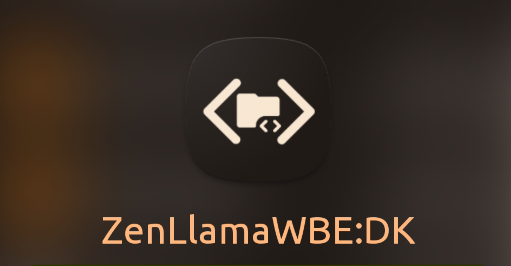
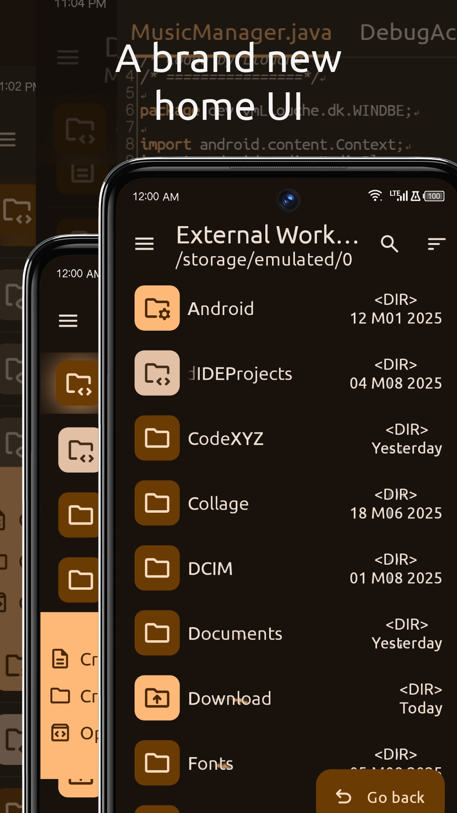
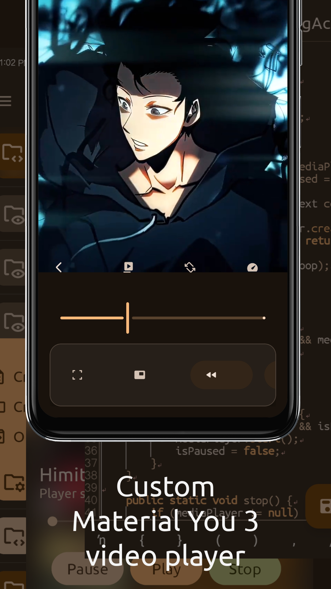
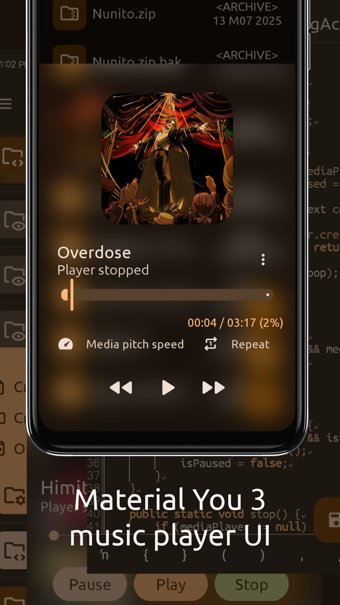

  

# ZenLlamaWBE:DK  
**ZenLlama Web Build Environment: Dev Kit**

ZenLlamaWBE:DK is an integrated development environment and dev toolkit designed for converting web-based projects into native Android apps. It combines powerful file management, a multi-tab code editor, and a streamlined build system into one lightweight app. Built for developers who want full control, minimalism, and speed.

## ‼️ What's New
> 
> ————————————————————————
> - 🔥 Added 3 new application theme. (Teal, Green, Sakura)
> - 🐛 Fixed some bugs. (There might be some left over bugs)
> - ⚡ Performance improvements: app now loads 90% faster.
> - 🎥 New custom Material You 3 based video player!
> - 🎧 New custom Material You 3 based music player!
> - 📱 Improved UI responsiveness on smaller screens  
> 
> ————————————————————————

---

## ✨ Features

- **Built-in File Manager**  
  Navigate, create, edit, and manage your project files directly within the app.

- **Code Editor with Tab Support**  
  Multi-tab editing with modification tracking and automatic backups.

- **Coming Soon**  
  - Web-to-App Builder (convert HTML/CSS/JS into native Android WebView APKs)  
  - Markdown rendering with live preview  
  - Custom App Build System (Gradle-free)

---

## 📸 Screenshots

> Interface preview:
---

---

---

---

---

## 🛠 Built With

- **Language:** Java  
- **UI:** Material 3 (M3)  
- **Editor:** [Sora Editor](https://github.com/Rosemoe/Sora-Editor) by Rosemoe *(LGPL)*  
- **UI FX:** [BlurView](https://github.com/Dimezis/BlurView) by Dimezis *(Apache 2.0)*

---

## 📜 License Info

This project uses third-party open-source libraries:

- **Sora Editor** – [LGPL v3.0](https://www.gnu.org/licenses/lgpl-3.0.html)  
- **BlurView** – [Apache License 2.0](http://www.apache.org/licenses/LICENSE-2.0)

---

## 📬 Contact

Developer: **Llouch Val Morvelle**  
Email: [valmorvelle@gmail.com](mailto:Llouche@proton.me)  
Location: Philippines

---

## 🚧 Disclaimer

ZenLlamaWBE:DK is under active development. Some features are experimental or incomplete. Use it at your own risk—but expect greatness lol.

---
